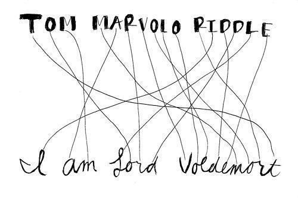
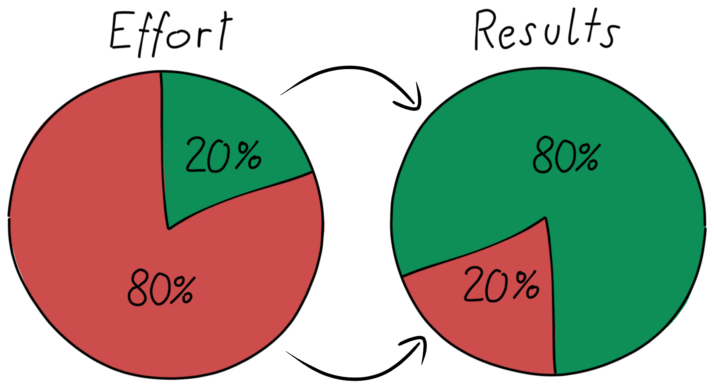
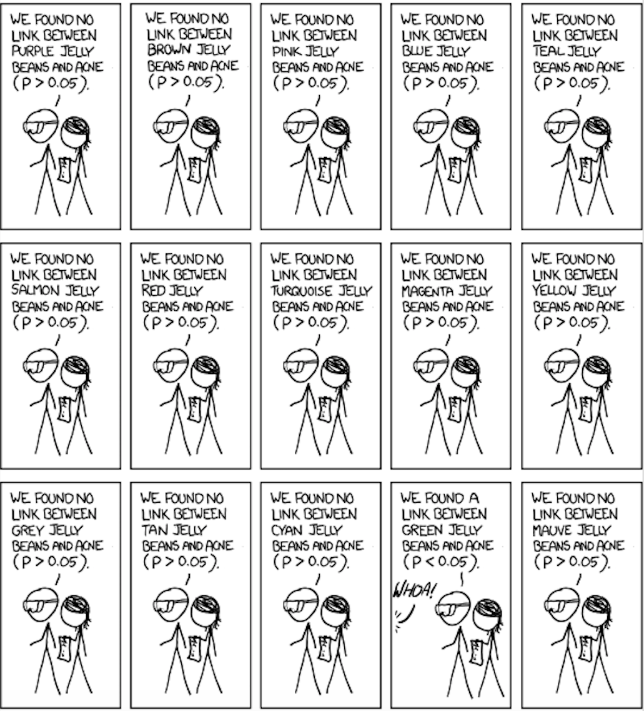

```{r, eval=TRUE, include=TRUE, echo=FALSE, message=FALSE, warning=FALSE}
# regarding `library()`: you don't have to `library(knitr)` if you `knitr::`
knitr::opts_chunk$set(eval=TRUE, include=TRUE, echo=TRUE, message=FALSE, warning=FALSE)

# knitting will default to pdf (rather than, e.g., html)
knitr::opts_chunk$set(dev='pdf')

# Defines a new code chunk `parameter=argument` option which will allow the
# size of printed code+output to be controlled using latex text size names:
# https://www.overleaf.com/learn/latex/Font_sizes%2C_families%2C_and_styles#Reference_guide
def.chunk.hook  <- knitr::knit_hooks$get("chunk")
knitr::knit_hooks$set(chunk = function(x, options) {
  x <- def.chunk.hook(x, options)
  ifelse(options$size != "normalsize", paste0("\n \\", options$size,"\n\n", x, "\n\n \\normalsize"), x)
})

color_block = function(color) {
  function(x, options) sprintf('\\color{%s}\\begin{verbatim}%s\\end{verbatim}',
                               color, x)
}
knitr::knit_hooks$set(message = color_block('red'))
knitr::knit_hooks$set(warning = color_block('red'))
knitr::knit_hooks$set(error = color_block('red'))
```


## Returning to the Heights Data

:::columns
::::column

\vspace{.33cm}
*Estimation of stature from foot
and shoe length: applications in forensic science*

- by B. Rohren

```{r, size="footnotesize"}
library(tidyverse)
heights <- read_csv("heights.csv")
glimpse(heights)
```

\vspace{.3cm}
$\phantom{+}$

::::
::::column

```{r, size="footnotesize", fig.width=3, fig.height=2}
# {r, fig.width=3, fig.height=2}
heights %>% ggplot(aes(
  x=shoePrint, y=height, color=sex)) + 
  geom_point() + theme_gray() +
  labs(title="Positive Linear Association",
       x="Length of Shoeprint (cm)",
       y="Height (cm)")
```

::::
:::


## As Promised Last Class... 

### 

```{r, size="footnotesize"}
library(broom); lm(height~shoePrint, data=heights) %>% broom::tidy() # R^2 0.6608845
lm(height~sex, data=heights) %>% tidy() %>% as.matrix() # R^2 0.6283874
lm(height~shoePrint+sex, data=heights) %>% tidy() %>% as.matrix() # R^2 0.6909145
# summary(lm(height~shoePrint+sex, data=heights))$r.squared
```


## What can we do with this? 

\vspace{-1.25cm}

\begin{block}{The Statistical Inference Landscape}

\begin{tabular}{lll}
${}$\\
\textbf{Hypothesis Testing} & \textbf{Estimation}* & \textbf{Model Prediction}\\\hline\\
$H_0: \beta_{1} = 0 \text{ reject at } \alpha=0.5$ & $\hat \beta_{1} = 2.007926$ & $\hat y_i \approx 112.7 + 2 x_{1i} + 7 \times \text{I}(x_{2i}=\text{M})$ \\
$H_0: \beta_{2} = 0 \overset{\text{\normalsize fail to}}{\text{ reject }} \text{at } \alpha=0.5$ & $\hat \beta_{2} = 7.001892$ & $R^2 \texttt{ 0.6909145}$\\
${}$\\
\end{tabular}

*Parameter Estimation includes Confidence Intervals as well (we just aren't covering it)

\end{block}

\vspace{-.25cm}
```{r, echo=FALSE}
lm(height~shoePrint+sex, data=heights) %>% tidy() # R^2 0.6909145
```
\vspace{-1.2in}
```{r, eval=FALSE}
lm(height~shoePrint+sex, data=heights) %>% tidy() # R^2 0.6909145
```


## The Coefficient of Determination $R^2$
\vspace{-.2cm}

$$R^2 = \frac{\sum_{i=1}^n(y_i - \bar y)^2 - \sum_{i=1}^n(y_i - \hat y_i)^2}{\sum_{i=1}^n(y_i - \bar y)^2} =  1- \frac{\sum_{i=1}^n(y_i - \hat y_i)^2}{\sum_{i=1}^n(y_i - \bar y)^2} \textcolor{gray}{\; = r^2}$$

### The "Proportion of Variation Explained" is a *Measure of Model Fit*
:::columns
::::column
$$Y_i = \beta_0 + \beta_1 x_{1i} + \epsilon_i$$
```{r, size="footnotesize"}
summary(lm(height~shoePrint, 
           data=heights))$r.squared
```
$$Y_i = \beta_0 + \beta_1 \text{I}(x_{2i}=\text{M}) + \epsilon_i$$
```{r, size="footnotesize"}
summary(lm(height~sex, 
           data=heights))$r.squared
```

::::
::::column

\vspace{-.4cm}
$$Y_i = \beta_0 + \beta_1 x_{1i} + \beta_1 \text{I}(x_{2i}=\text{M}) + \epsilon_i$$
\vspace{-.65cm}
```{r, size="footnotesize"}
summary(lm(height~shoePrint+sex, 
           data=heights))$r.squared
```

\vspace{.35cm}

- What does $\text{I}(x_{2i}=\text{M})$ mean?
- Do you understand this model?
- Is the increase in $R^2$ expected?
- Which model best predicts the data? 
- Is $R^2$ a good way to decide?

::::
:::


## The Coefficient of Determination $R^2$
\vspace{-.2cm}

$$R^2 = \frac{\sum_{i=1}^n(y_i - \bar y)^2 - \sum_{i=1}^n(y_i - \hat y_i)^2}{\sum_{i=1}^n(y_i - \bar y)^2} =  1- \frac{\sum_{i=1}^n(y_i - \hat y_i)^2}{\sum_{i=1}^n(y_i - \bar y)^2} \textcolor{gray}{\; = r^2}$$

### The "Proportion of Variation Explained" is a *Measure of Model Fit*
:::columns
::::column
$$Y_i = \beta_0 + \beta_1 x_{1i} + \epsilon_i$$
```{r, size="footnotesize"}
# Same for Simple Linear Regression
cor(heights$shoePrint, heights$height)^2
```
$$Y_i = \beta_0 + \beta_1 \text{I}(x_{2i}=\text{M}) + \epsilon_i$$
```{r, size="footnotesize"}
cor(as.numeric(as.factor(heights$sex)), 
    heights$height)^2
```

::::
::::column

\vspace{-.4cm}
$$Y_i = \beta_0 + \beta_1 x_{1i} + \beta_1 \text{I}(x_{2i}=\text{M}) + \epsilon_i$$
\vspace{-.65cm}
```{r, size="footnotesize"}
summary(lm(height~shoePrint+sex, 
           data=heights))$r.squared
# `cor()` to match R^2 ?
# doesn't make sense here...
```

\vspace{.35cm}

- Is the increase in $R^2$ expected?
- Which model best predicts the data? 
- Is $R^2$ a good way to decide?

::::
:::


## Variable Selection with Hypothesis Testing

### p-values are for the "Last Variable Added"

:::columns
::::column

```{r, size="footnotesize"}
lm(height~shoePrint, data=heights) %>% 
  tidy()%>%select(term,estimate,p.value)
lm(height~sex, data=heights) %>% 
  tidy()%>%select(term,estimate,p.value)
```

::::
::::column

```{r, size="footnotesize"}
lm(height~shoePrint+sex,data=heights)%>% 
  tidy()%>%select(term,estimate,p.value)
```

\vspace{0.35cm}

- Both p-values are weaker when the model includes both of the variables

\vspace{0.15cm}

- The other variable already in the model already explains the variation

::::
:::


## Which Variable Predicts Height? 

### The model can't tell which variable to attribute the explanation too 

```{r, echo=FALSE, fig.width=5.5, fig.height=2.25}
# {r, fig.width=3, fig.height=2}
heights %>% ggplot(aes(
  x=shoePrint, y=height, color=sex)) + 
  geom_point() + theme_gray() +
  labs(title="Positive Linear Association",
       x="Length of Shoeprint (cm)",
       y="Height (cm)")
```


Thus, the "effect" of each variable detracts from each other, reducing both p-values 


## [Not Un]Observed Confounding: Multicollinearity

:::columns
::::column

```{r, size="footnotesize"}
cor(as.numeric(as.factor(heights$sex)), 
    heights$shoePrint)
```

```{r, eval=FALSE, size="scriptsize"}
# {r, fig.width=5, fig.height=3.5}
heights %>% select(height,shoePrint,sex) %>% 
  mutate(sex=as.numeric(as.factor(sex))) %>% 
  cor() %>% as_tibble(rownames="rowname") %>% 
  pivot_longer(cols=!rowname, 
    names_to="Variable 1", 
    values_to="Correlation") %>% 
  rename("Variable 2"=rowname) %>% 
  ggplot(aes(x=`Variable 1`, y=`Variable 2`, 
            fill=Correlation,
            label=round(Correlation,2))) +  
  geom_tile() + geom_text(color="white")
```  
  
::::
::::column

A multivariate linear regression model can't "de-tangle" contributions of correlated (positive or negative) variables

```{r, echo=FALSE, fig.width=5, fig.height=3.5}
heights %>% select(height,shoePrint,sex) %>% 
  mutate(sex=as.numeric(as.factor(sex))) %>% 
  cor() %>% as_tibble(rownames="rowname") %>% 
  pivot_longer(cols=!rowname, 
    names_to="Variable 1", 
    values_to="Correlation") %>% 
  rename("Variable 2"=rowname) %>% 
  ggplot(aes(x=`Variable 1`, y=`Variable 2`, 
            fill=Correlation,
            label=round(Correlation,2))) +  
  geom_tile() + geom_text(color="white")
```  

::::
:::

- As an extreme example, suppose $x_{1i}$ and $x_{2i}$ are identical, then
$\hat y_i = x_{1i} + x_{2i} = 2 x_{1i} + 0 x_{2i}$ and linear regression can't tell the difference

## Statistical VS Practical Significance

```{r, size="footnotesize"}
least_squares_fit <- lm(height~shoePrint+sex,data=heights) # If sexM was significant
summary(least_squares_fit)$coefficients # would it actually be practically relevant?
```

:::columns
::::column

```{r, echo=FALSE, size="footnotesize", fig.width=3, fig.height=2}
library(broom); heights %>% ggplot(aes(
  x=shoePrint, y=height, color=sex)) +
  geom_point(alpha=0.5) +# <- SEE OVERLAPPING POINTS
  geom_line(data=augment(least_squares_fit),  
            aes(y=.fitted, colour=sex), size=1.5) +
  labs(title="Does this difference matter?",
       x="Length of Shoeprint (cm)",
       y="Height (cm)")
```

::::
::::column

```{r, echo=FALSE, size="footnotesize", fig.width=3, fig.height=2}
library(broom); heights %>% ggplot(aes(
  x=shoePrint, y=height, color=sex)) +
  geom_line(data=augment(least_squares_fit),  
            aes(y=.fitted, colour=sex)) +
  labs(title="Does this difference matter?",
       x="Length of Shoeprint (cm)",
       y="Height (cm)") + 
  xlim(c(0,35)) + ylim(c(0,200))
```

::::
:::

## An Alternative Method: 80/20 Train-Test Split

1. $R^2$-based model selection is problematic since more explanatory variables means more parameters which means larger $R^2$ because the model can Overfit the data 

    - Overfitting data menas a random chance pattern gets interpreted as a real pattern 

2. Variable Selection Hypothesis Testing is problematic since testing order is arbitrary

3. Another (very good) idea (from data science) is to fit the model on some data, and then score the model on some different data. **This is called a Train-Test split**

|In Sample Performance |Variable Selection | Out of Sample Performance |
|:-:|:-:|:-:|
| {height=100px} |{height=100px} | {height=100px}|

```{r, eval=FALSE, include=FALSE}
download.file(url = "https://i.pinimg.com/originals/cd/6c/c6/cd6cc688c933e0d7eba23486cacaf428.jpg",
              destfile = "images/tomrid.jpg", mode = 'wb')
download.file(url = "https://vidagoals.com/wp-content/uploads/2021/08/pareto-principle.png",
              destfile = "images/8020.png", mode = 'wb')
download.file(url = "https://blog.f1000.com/wp-content/uploads/2014/09/JesusOnToast2.jpg",
              destfile = "images/jesus.jpg", mode = 'wb')
```


## An Alternative Method: 80/20 Train-Test Split

The "80/20 rule" for a Train-Test Split analysis is

### Fit a model on 80% of the data $\rightarrow$ "score" the model on the remaining 20%

\vspace{.2cm}

$R^2=1- \frac{\sum_{i=1}^n(y_i - \hat y_i)^2}{\sum_{i=1}^n(y_i - \bar y)^2}$ is one possible model score; but, it's simpler to just use
\vspace{-.7cm}

\LARGE $$\text{Root Mean Square Error}\quad\text{RMSE} = \sqrt{\frac{1}{n}\sum_{j=1}^m (y_i - \hat y_i)^2}$$

\normalsize

- $\hat y_i$ is the prediction from the model fit using 80% of the data
- $j$ indexes over the $m$ data comprising the remaining 20% 
- The square root keeps the original (rather than squared) units
- And the denomenator isn't $n-1$ like when estimating variance


## An Alternative Method: 80/20 Train-Test Split

- RMSE is about the fact that you're doing something (predicting) in the sample
- *So you should try to see how well you can do that thing in the population...*

\begin{minipage}[t]{0.4\linewidth}
```{r, eval=FALSE, include=FALSE}
download.file(url = "https://blogs.gartner.com/jitendra-subramanyam/files/2019/07/two-samples-from-population.png",
              destfile = "images/2sample.png", mode = 'wb')
```
\includegraphics[trim=70 85 0 0, clip, width=\textwidth]{images/2sample.png}

\vspace{-.15in}
$\,$Sample $\;\;$ (split in two, say 80/20)

\end{minipage}\hfill
\begin{minipage}[t]{0.59\linewidth}

\vspace{-2.275in}

\textbf{$\leftarrow$ Here we split a "representative" population}

\hspace{.2in}\textbf{sample into two "representative" samples}

\footnotesize 

\begin{enumerate}
\item You fit the model based on a "representative" sample
\item So subsamples are "representative of the population"
\item Use 80\% of the data to fit the "representative" model
\item Use 20\% to see if the model's actually "representative"
\end{enumerate}

\normalsize

\textbf{This strategy shows when the model for 80\% of the data
doesn't work well for the remaing 20\% of the data, which could happen if}

\small 

\begin{itemize}
\item The subsample aren't "representative" to begin with
\item The model is overly specific to 80\% of the data
\end{itemize}

\end{minipage}

## An Alternative Method: 80/20 Train-Test Split

\vspace{-.75cm}

\LARGE $$\text{Root Mean Square Error}\quad\text{RMSE} = \sqrt{\frac{1}{n}\sum_{j=1}^m (y_i - \hat y_i)^2}$$

\normalsize

\vspace{-.25cm}
is based on scoring how well a created model explains new data  

\vspace{-.25cm}
| | | 
|-|-| 
| $\rightarrow$ How good it is at predicting new data | $\rightarrow$ How well it generalizes to new data |

\vspace{-.25cm}
Prediction (RMSE) doesn't care about confounding or multicollinearity

- If $x_{1i}$ and $x_{2i}$ are identical, the prediction $\hat y_i = x_{1i} + x_{2i} = 2 x_{1i} + 0 x_{2i}$ is the same
- (outcome) *Prediction* and (parameter) *Inference* are related but different exercises


### If predictions are not generalizing to new data well, the model may be ***overfit***
- it may be representing idiosyncratic spurious patterns of the model fitting data

\vspace{.25cm}
$\rightarrow$ If predictions could be generally improved, then the model is said to be *underfit*


## An Alternative Method: 80/20 Train-Test Split

### Fit a model on 80% of the data $\rightarrow$ "score" the model on the remaining 20%


:::columns
::::column

```{r, size="footnotesize"}
n <- dim(heights)[1] # nrow(heights)
n_train <- as.integer(n*0.8)
n_test <- n - n_train
set.seed(130)
training_indices <- 
  sample(1:n,size=n_train,replace=FALSE)
heights <- heights %>% rowid_to_column()
train <- heights %>% 
  filter(rowid %in% training_indices)
test <- heights %>% 
  filter(!(rowid %in% training_indices))
```

- There was not p-value evidence at the $\alpha=0.05$ significance  level
for `lm(height~shoePrint+sex)`
::::
::::column

```{r, size="footnotesize"}
model <- lm(height~shoePrint, data=train)
yhat_test <- predict(model, newdata=test)
sqrt(mean(test$height-yhat_test)^2)

model <- lm(height~sex, data=train)
yhat_test <- predict(model, newdata=test)
sqrt(mean(test$height-yhat_test)^2)

model <- lm(height~shoePrint+sex, data=train)
yhat_test <- predict(model, newdata=test)
sqrt(mean(test$height-yhat_test)^2)
```

- But there is train-test evidence

::::
:::


## An Alternative Method: 80/20 Train-Test Split

### Fit a model on 80% of the data $\rightarrow$ "score" the model on the remaining 20%

:::columns
::::column

```{r, size="footnotesize"}
n <- dim(heights)[1] # nrow(heights)
n_train <- as.integer(n*0.8)
n_test <- n - n_train
set.seed(131)
training_indices <- 
  sample(1:n,size=n_train,replace=FALSE)
#heights <- heights %>% rowid_to_column()
train <- heights %>% 
  filter(rowid %in% training_indices)
test <- heights %>% 
  filter(!(rowid %in% training_indices))
```

- There was not p-value evidence at the $\alpha=0.05$ significance  level
for `lm(height~shoePrint+sex)`
::::
::::column

```{r, size="footnotesize"}
model <- lm(height~shoePrint, data=train)
yhat_test <- predict(model, newdata=test)
sqrt(mean(test$height-yhat_test)^2)

model <- lm(height~sex, data=train)
yhat_test <- predict(model, newdata=test)
sqrt(mean(test$height-yhat_test)^2)

model <- lm(height~shoePrint+sex, data=train)
yhat_test <- predict(model, newdata=test)
sqrt(mean(test$height-yhat_test)^2)
```

- But there is train-test evidence?

::::
:::


## An Alternative Method: 80/20 Train-Test Split

\vspace{.2cm}

\begin{block}{Fit a model on 80\% of the data $\rightarrow$ "score" the model on the remaining 20\%}
\begin{itemize}
\item The train-test method is a wonderful tool in LARGE data contexts
\begin{itemize}
\item when there's enough data so the random train-test split isn't just "lucky"
\end{itemize}
\item In its more advanced (data science) forms, train-test is a powerful model tuning tool
\end{itemize}
\end{block}

\vspace{-.4cm}

:::columns
::::column

\vspace{-.15cm}

| | |
|-|-|
| {height=175px} | {height=175px} |

```{r, eval=FALSE, include=FALSE}
download.file(url = "https://images.squarespace-cdn.com/content/v1/5435e221e4b083e263348982/1530318848971-DLPU4NUCEW5X75NCE8S3/Jelly-beans-p-value+2.png",
              destfile = "images/jb1.png", mode = 'wb')
download.file(url = "https://images.squarespace-cdn.com/content/v1/5435e221e4b083e263348982/1530314928700-5K6MR0HDAJ26VY9J2TNL/Jelly-beans-p-value.png",
              destfile = "images/jb2.png", mode = 'wb')
```

::::
::::column

\vspace{.5cm}
$\quad\quad\quad \bullet$ Like Hypothesis Testing, it is  
$\quad\quad\quad\;\;\;$ subject to "random chance"   
$\quad\quad\quad\;\;\;$ (of the test-train split)   
$\quad\quad\quad \bullet$ Unlike Hypothesis Testing, it is  
$\quad\quad\quad\;\;\;$ based on observed out of sample  
$\quad\quad\quad\;\;\;$ generalizability, rather than tests   
$\quad\quad\quad\;\;\;$ based on modeling assumptions  
$\quad\quad\quad \bullet$ It's not about parameters or  
$\quad\quad\quad\;\;$ 'right' or 'wrong', but picking  
$\quad\quad\quad\;\;$ models predicting new data 'well'    
::::
:::


## ebay Auctions of Mario Kart Games

:::columns

::::column

```{r, eval=FALSE, include=FALSE}
download.file(url = "https://upload.wikimedia.org/wikipedia/en/a/a1/Mario_Kart_64.jpg",
              destfile = "images/mario.jpg", mode = 'wb')
download.file(url = "https://www.bitrefill.com/content/cn/b_rgb%3AFFFFFF%2Cc_pad%2Ch_720%2Cw_1280/v1559249249/ebay.jpg",
              destfile = "images/ebay.jpg", mode = 'wb')
```

\vspace{.25cm}
{width=230px}
{width=230px}

::::
::::column

```{r, size="footnotesize"}
library(openintro)
glimpse(mariokart)
```

::::
:::


## Is auction length associated with the selling price?

:::columns
::::column

```{r, size="footnotesize", fig.width=3, fig.height=2}
# {r, fig.width=3, fig.height=2}
mariokart %>% ggplot(aes(x=duration, 
                         y=total_pr)) + 
  geom_point() + labs(x="Duration (in days)", 
                      y="Total price ($)")
# the outliers are multi-item purchases
```

::::
::::column

```{r, size="footnotesize", fig.width=3, fig.height=2}
mariokart %>% filter(total_pr < 100) %>% 
  ggplot(aes(x=duration, y=total_pr)) +
  geom_smooth(method=lm, se=FALSE) + 
  geom_point() + labs(x="Duration (in days)", 
                      y="Total price ($)") 
# Moderate negative linear(?) association?
```

::::
:::

## Moderate Negative Linear(?) Association?

:::columns
::::column

```{r, size="footnotesize", fig.width=3, fig.height=2}
mariokart2 <- mariokart %>% 
  filter(total_pr < 100)
model1 <- lm(total_pr~duration, 
             data=mariokart2)
summary(model1) %>% tidy() %>% 
  select(-statistic) %>% 
  rename(se=std.error)
summary(model1)$r.squared
```

\vspace{-.25in}
\begin{align*}
\hat y_i = {} & \hat \beta_0 + \hat \beta_1 x_{1i}\\
\approx {} & 52.4 -1.3 \times \text{duration}_{i}
\end{align*}

::::
::::column

```{r, size="footnotesize", fig.width=3, fig.height=2}
mariokart2 %>% 
  ggplot(aes(x=duration, y=total_pr)) +
  geom_smooth(method=lm, se=FALSE) + 
  geom_point() + labs(x="Duration (in days)", 
                      y="Total price ($)") 
# Moderate negative linear(?) association?
```

::::
:::


## Another Variable: `cond(ition) new/used`

:::columns
::::column

```{r, size="footnotesize", fig.width=3, fig.height=2}
mariokart2 %>% ggplot(aes(
  x=duration, y=total_pr, color=cond)) +
  geom_point() + labs(x="Duration (in days)", 
                      y="Total price ($)")
```

::::
::::column

```{r, size="footnotesize", fig.width=3, fig.height=2}
mariokart2 %>% 
  ggplot(aes(x=cond, y=total_pr)) +
  geom_boxplot() +
  labs(x="Condition", y="Total price ($)")
```

::::
:::


## Another Variable: `cond(ition) new/used`

:::columns
::::column

```{r, size="footnotesize", fig.width=3, fig.height=2}
model2 <- lm(total_pr~cond, 
             data=mariokart2)
summary(model2) %>% tidy() %>% 
  select(-statistic) %>% 
  rename(se=std.error)
summary(model2)$r.squared
```

\vspace{-.25in}
\begin{align*}
\hat y_i = {} & \hat \beta_0 + \hat \beta_1 (x_{2i}=\text{used})\\
\approx {} & 53.7 -10.9 \times \text{I}(\texttt{cond}_{i}=\text{used})
\end{align*}

::::
::::column

```{r, size="footnotesize", fig.width=3, fig.height=2}
mariokart2 %>% 
  ggplot(aes(x=cond, y=total_pr)) +
  geom_boxplot() +
  labs(x="Condition", y="Total price ($)")
```

::::
:::

## Two Variables: `duration` $+$ `cond(ition) new/used`

:::columns
::::column

```{r, size="footnotesize", fig.width=3, fig.height=2}
model3 <- lm(total_pr~duration+cond, 
             data=mariokart2)
summary(model3) %>% tidy() %>% 
  select(-statistic) %>% 
  rename(se=std.error)
summary(model3)$r.squared
```

::::
::::column

```{r, size="footnotesize", fig.width=3, fig.height=2}
library(broom); mariokart2 %>% ggplot(aes(
  x=duration, y=total_pr, color=cond)) +
  geom_point(alpha=0.5) +# <- SEE OVERLAPPING 
  geom_line(data=augment(model3),    # POINTS
            aes(y=.fitted, colour=cond)) +
  labs(x="Duration (in days)", y="Total price ($)")
```

::::
:::

:::columns
::::column

\vspace{-.5in}
\begin{align*}
\quad \hat y_i = {} & \hat \beta_0 + \hat \beta_1 x_{1i} + \hat \beta_2 \text{I}(x_{2i}=\text{used})\\
\quad \approx {} & 53.7 -0.4 \times \texttt{duration}_{i} -9.9 \times \text{I} (\texttt{cond}_{i}=\text{used})
\end{align*}

::::
::::column

::::
:::


## Two Variables: `duration` $+$ `cond(ition) new/used`


\vspace{-.5in}
\Large
\begin{align*}
\hat y_i = {} &
\begin{cases}
\begin{array}{lr} (\hat \beta_0+\hat\beta_2) + x_{1i} \hat \beta_1 & \;\text{ if }\texttt{cond}_i=\text{used}  \\ \hat \beta_0 + x_{1i}\hat \beta_1 \quad \text{[baseline]} & \text{otherwise} \end{array}
\end{cases}\\
 = {} &
\begin{cases}
\begin{array}{lr} (53.7-9.9) -0.4\times \text{duration}_{i}  & \;\text{ if }\texttt{cond}_i=\text{used} \\ 53.7 -0.4 \times \text{duration}_{i}  \quad \texttt{[baseline]} & \text{otherwise} \end{array}
\end{cases}
\end{align*}

\normalsize
```{r}
model3 <- lm(total_pr~duration+cond, data=mariokart2)
summary(model3)$coefficients
```


##

```{r, size="footnotesize"}
model3
library(broom); augment(model3) %>% print(n=6)
```

## Interactions: `duration` $\times$ `cond(ition) new/used`

:::columns
::::column

```{r, size="footnotesize", fig.width=3, fig.height=2}
model4 <- lm(total_pr~duration*cond, 
             data=mariokart2)
summary(model4) %>% tidy() %>% 
  select(-statistic, -std.error)
summary(model3)$r.squared
```

::::
::::column

```{r, size="footnotesize", fig.width=3, fig.height=2}
library(broom); mariokart2 %>% ggplot(aes(
  x=duration, y=total_pr, color=cond)) +
  geom_point(alpha=0.5) + 
  geom_line(data=augment(model4),
            aes(y=.fitted, colour=cond)) +
  labs(x="Duration (in days)", y="Total price ($)")
```

::::
:::


\vspace{-.25in}

:::columns
::::column

\vspace{-.135in}
\begin{align*}
\quad \hat y_i = {} & \hat \beta_0 + \hat \beta_1 x_{1i} + \hat \beta_2 \text{I}(x_{2i}=\text{used}) + \hat \beta_3 x_{1i}(x_{2i}=\text{used})\\
\approx {} & 58.3 -2.0 \times \texttt{duration}_{i} -17.1 \times \text{I} (\texttt{cond}_{i}=\text{used}) + 2.3 \times \texttt{duration}_{i} \times \text{I}(\texttt{cond}_{i}=\text{used})
\end{align*}

::::
::::column

::::
:::


## Interactions: `duration` $\times$ `cond(ition) new/used`


\vspace{-.5in}
\Large
\begin{align*}
\hat y_i = {} &
\begin{cases}
\begin{array}{lr} \hat \beta_0 + x_{1i}\hat \beta_1 \quad \text{[baseline]} & \text{if }\texttt{cond}_i=\text{new}\\ (\hat \beta_0+\hat\beta_2) + x_{1i}  (\hat \beta_1+\hat \beta_3) & \;\text{ if }\texttt{cond}_i=\text{used} \end{array}
\end{cases}\\
 = {} &
\begin{cases}
\begin{array}{lr}58.3 - 2.0 x_{1i} \quad \text{[baseline]} & \text{if }\texttt{cond}_i=\text{new}\\ (58.3-17.1) + (2.3 - 2.0) x_{1i} & \;\text{ if }\texttt{cond}_i=\text{used} \end{array}
\end{cases}
\end{align*}

\normalsize
```{r}
model4 <- lm(total_pr~duration*cond, data=mariokart2)
summary(model4)$coefficients
```


## Model Comparison

\vspace{-.75in}

| | |
|-|-|
| $x_{1i}$: auction diration of $i^{th}$ item | $x_{2i}$: condition of $i^{th}$ item |

\vspace{-.15in}

- Model 1: $y_i = \beta_0 + \beta_1 x_{1i} + \epsilon_i$
- Model 2: $y_i = \beta_0 + \beta_1 \text{I}(x_{1i}=\text{used}) + \epsilon_i$
- Model 3: $y_i = \beta_0 + \beta_1 x_{1i} + \beta_2 \text{I}(x_{2i}=\text{used}) + \epsilon_i$
- Model 4: $y_i = \beta_0 + \beta_1 x_{1i} + \beta_2 \text{I}(x_{2i}=\text{used}) + \beta_3 x_{1i}\text{I}(x_{2i}=\text{used}) + \epsilon_i$


## Model Comparison

\vspace{.05in}

| | |
|-|-|
| $x_{1i}$: auction diration of $i^{th}$ item | $x_{2i}$: condition of $i^{th}$ item |

\vspace{-.15in}

- Model 1 Fit: $\hat y_i \approx 52.4 - 1.32 x_{1i}$
- Model 2 Fit: $\hat y_i \approx 53.8 - 10.9 \times \text{I}(x_{1i}=\text{used})$
- Model 3 Fit: $\hat y_i \approx 54.7 -0.4 x_{1i} - 9.9 \times \text{I}(x_{2i}=\text{used})$
- Model 4 Fit: $\hat y_i \approx 58.3 - 2.0 x_{1i} - 17.1 \times \text{I}(x_{2i}=\text{used}) + 2.3 x_{1i}\times \text{I}(x_{2i}=\text{used})$

### 

```{r, eval=FALSE}
summary(model1)$r.squared # 0.1399937
summary(model2)$r.squared # 0.3505528
summary(model3)$r.squared # 0.3609101
summary(model4)$r.squared # 0.435015
```

## What is each part of this code doing?

```{r}
set.seed(130); 
n <- nrow(mariokart2)
training_indices <- sample(1:n, size=round(0.8*n))
mariokart2 <- mariokart2 %>% rowid_to_column() 
train <- mariokart2 %>% filter(rowid %in% training_indices)
y_train <- train$total_pr
test <- mariokart2 %>% filter(!(rowid %in% training_indices))
y_test <- test$total_pr
model1_train <- lm(total_pr ~ duration, data = train)
model2_train <- lm(total_pr ~ cond, data = train)
model3_train <- lm(total_pr ~ duration + cond, data=train)
model4_train <- lm(total_pr ~ duration * cond, data=train)
```

## Model Comparison

```{r}
yhat_model1_test <- predict(model1_train, newdata=test)
yhat_model2_test <- predict(model2_train, newdata=test)
yhat_model3_test <- predict(model3_train, newdata=test)
yhat_model4_test <- predict(model4_train, newdata=test)
model1_test_RMSE <- sqrt(mean((y_test-yhat_model1_test)^2))
model2_test_RMSE <- sqrt(mean((y_test-yhat_model2_test)^2))
model3_test_RMSE <- sqrt(mean((y_test-yhat_model3_test)^2))
model4_test_RMSE <- sqrt(mean((y_test-yhat_model4_test)^2))
yhat_model1_train <- predict(model1_train, newdata=train)
yhat_model2_train <- predict(model2_train, newdata=train)
yhat_model3_train <- predict(model3_train, newdata=train)
yhat_model4_train <- predict(model4_train, newdata=train)
model1_train_RMSE <- sqrt(mean((y_train-yhat_model1_train)^2))
model2_train_RMSE <- sqrt(mean((y_train-yhat_model2_train)^2))
model3_train_RMSE <- sqrt(mean((y_train-yhat_model3_train)^2))
model4_train_RMSE <- sqrt(mean((y_train-yhat_model4_train)^2))
```

## Model Comparison

```{r, fig.width=5.5, fig.height=2, size="scriptsize"}
mytable <- tibble(Model = c("Model 1", "Model 2", "Model 3", "Model 4"),
  RMSE_testdata = c(model1_test_RMSE, model2_test_RMSE, model3_test_RMSE, model4_test_RMSE),
  RMSE_traindata = c(model1_train_RMSE, model2_train_RMSE, model3_train_RMSE, model4_train_RMSE))
mytable %>% rowid_to_column() %>% ggplot() + labs(x="Model", y="RMSE") +
  geom_point(aes(x=rowid, y=RMSE_testdata, color="Test")) +
  geom_point(aes(x=rowid, y=RMSE_traindata, color="Train"))
```
